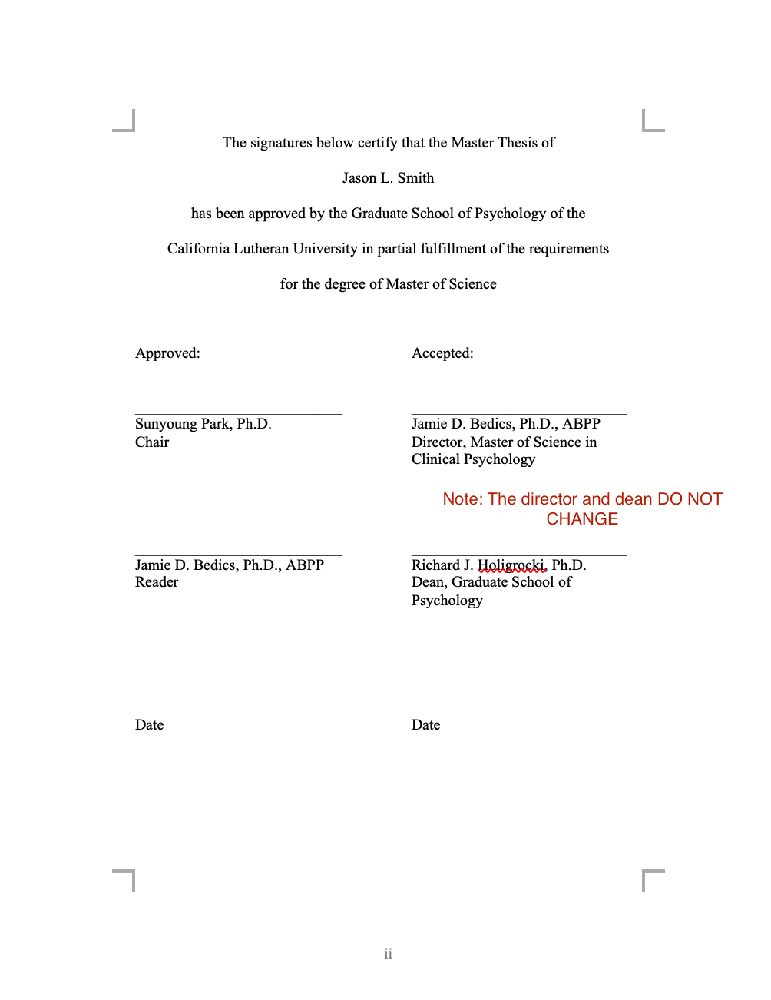

# Formatting


```{r, echo=FALSE}
knitr::include_graphics("images/apamanual.png")
```


 The thesis paper is completed in a manner consistent with the [Publication Manual of the APA (7th Edition)](https://www.amazon.com/s?k=apa+publication+manual+7th+edition&crid=7T10VJ2PYQZH&sprefix=apa+pu%2Caps%2C261&ref=nb_sb_ss_i_1_6). Specifically, the following sections should follow, exactly, the guidelines defined by the 7th Edition:

  * Abstract
  * Introduction
  * Method
  * Results
  * Discussion
  * References
  * Tables
  * Figures
  * Appendices
  
There are several sections that **do not** follow the 7th Edition of the Publication Manual:

  * Title Page
  * Table of Contents

For examples of these, please see the Thesis Materials section of the MSCP homepage in Blackboard.  General guidelines can be followed below:

___

## Title Page Guidelines

```{r, echo=FALSE}
knitr::include_graphics("images/titlepage.png")
```


## Signature Page Guidelines

```{r, echo=FALSE}

```


## Table of Contents Guidelines


```{r, echo=FALSE}
knitr::include_graphics("images/tablecontents.png")
```

## Final Ordering

**1. Title Page (according to CLU format and not APA)**

This page provides the name of the thesis project, names of the university and school or department, and date of completion. The title page should be prepared in accordance with the sample page found in this section. The date at the bottom of the page is the month and year the degree is awarded. The title page is unnumbered but is counted as page “i.”

___


**2. Signature Page (according to CLU format and not APA)**

This page provides the name of the author and blank lines for the signatures of the committee members and the Graduate Dean of the appropriate School. The pages are signed when the members and Dean determine that the thesis or project is complete. The approval page should comply with the page form found in Appendix B. It should bear original signatures for all copies. The date at the bottom of the page is the date the degree is awarded; however, the page is not counted in the numbering system.

___

**3. Dedication (optional)**

This optional page contains a brief dedication to the individual(s) whom the author wishes to honor. If included, thispageisnumberedaspage“ii” (lowercaseRomannumeral).

___


**4. Acknowledgements (optional)**

This optional page lists persons and/ or institutions whom the author wishes to thank for their assistance in completing the thesis or project. Such assistance can be provision of personal, financial, or moral support, or access to data sets or subject populations. A brief statement as to the type of assistance provided may follow each person or institution named. If included, this page continues the lower case R oman numeral sequence begun above.

___


**5. Table of Contencts (accoridng to CLU format)**

___


**6. Abstract (APA style)**

___


**7. Introduction (APA style)**

___


**8. Method (APA style)**

___


**9. Data Analytic Method (APA style)**

___


**10. Results (APA style)**

___


**11. Discussion (APA style)**

___


**12. References (APA style)**

___


**13. Tables (APA style)**

___


**14. Figures (APA style)**

___


**15. Appendix 1 - Pre-Registration**

___


**16. Appendix 2 - IRB Approval**

___


**17. Appendix # - optional as needed**


___


