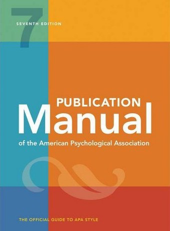

# Formatting - Overview


```{r, echo=FALSE}

```


 The thesis paper is completed in a manner consistent with the [Publication Manual of the APA (7th Edition)](https://www.amazon.com/s?k=apa+publication+manual+7th+edition&crid=7T10VJ2PYQZH&sprefix=apa+pu%2Caps%2C261&ref=nb_sb_ss_i_1_6). Specifically, the following sections should follow, exactly, the guidelines defined by the 7th Edition:

  * Abstract
  * Introduction
  * Method
  * Results
  * Discussion
  * References
  * Tables
  * Figures
  * Appendices
  
There are several sections that **do not** follow the 7th Edition of the Publication Manual:

  * Title Page
  * Signature Page
  * Table of Contents
  

For examples of the sections that do not follow APA style please see the Thesis Materials section of the MSCP homepage in Blackboard and the examples in the following sections of this manual.

___

## 1. Title Page

This page provides the name of the thesis project, names of the university and school or department, and date of completion. The title page should be prepared in accordance with the sample page found in this section. The date at the bottom of the page is the month and year the degree is awarded. The title page is unnumbered but is counted as page “i.”

```{r, echo=FALSE}
knitr::include_graphics("images/titlepage.png")
```

___

## 2. Signature Page

This page provides the name of the author and blank lines for the signatures of the committee members and the Graduate Dean of the appropriate School. The pages are signed when the members and Dean determine that the thesis or project is complete. The approval page should comply with the page form found in Appendix B. It should bear original signatures for all copies. The date at the bottom of the page is the date the degree is awarded; however, the page is not counted in the numbering system.

```{r, echo=FALSE}
knitr::include_graphics("images/signaturepage.png")
```

___

## 3. Dedication (optional)

This optional page contains a brief dedication to the individual(s) whom the author wishes to honor. If included, this page is numbered as page “ii” (lower case Roman numeral).

___


## 4. Acknowledgements (optional)

This optional page lists persons and/ or institutions whom the author wishes to thank for their assistance in completing the thesis or project. Such assistance can be provision of personal, financial, or moral support, or access to data sets or subject populations. A brief statement as to the type of assistance provided may follow each person or institution named. If included, this page continues the lower case Roman numeral sequence begun above.

___


## 5. Table of Contents


```{r, echo=FALSE}
knitr::include_graphics("images/tablecontents.png")
```


___


## APA Sections of the Paper

**6. Abstract (APA style)**

The abstract follows APA style and typically completed in the spring of the second semester.  A draft of the abstract, without results and without concluding statements, might be drafted during *PSYC 565 Research Practicum* during the of the second year. 

___


**7. Introduction (APA style)**

As noted in the section "Literature Review Timeline," the introduction is drafted during the first semester of the first year in *PSYC 564* and revised every semester of the year.  The introduction is a comprehensive document that demonstrates the students' expertise in the area under study.  

___


**8. Method (APA style)**

As noted in the "Method Section Timeline," portions of the Method section can be drafted during the spring semester and finalized during PSYC 565 in the fall of the second year.  The method section defines the procedures of the study and is required for successful IRB approval at CLU.  IRB is accomplished during PSYC 565 in the of the second year but students should review CLU IRB requirements as soon as possible.  A link to the CLU IRB can be found here: [https://www.callutheran.edu/research/irb/](https://www.callutheran.edu/research/irb/).


___


**9. Data Analytic Method (APA style)**

The data analytic plan can be developed during PSYC 562 in the spring of the first year and finalized during PSYC 565 in the of the second year.  At CLU, we exclusively use the statistical program language called R. The data analytic section will include a power analysis as well a link to the study's pre-registration of the data analysis. 

___

**10. Results (APA style)**

The results are typically drafted during the spring of second year.  *PSYC 566 Thesis* is an independent study unit and there are no class meetings.  Instead, students meet with their thesis chair to review and write their analyses in the results section. 

___


**11. Discussion (APA style)**

The discussion is a critical section of the research paper and is typically **10-pages** minimum.  In the discussion the student provide the following:

  * A summary of the proposed hypotheses and rationale.
  * A review of the results in narrative form without the presentation of any statistics.
  * A discussion of the implications of the results for each hypothesis. 
  * A discussion of future steps for each hypothesis.
  * A discussion of the limitations of the study in addressing each hypothesis.

The discussion section demonstrates the student's ability to place their study in the context of the larger literature and think more philosophically.  It is a space for creativity and ingenuity.  
  
___


**12. References (APA style)**

___


**13. Tables (APA style)**

___


**14. Figures (APA style)**

___


**15. Appendix 1 - Pre-Registration**

___


**16. Appendix 2 - IRB Approval**

___


**17. Appendix # - optional as needed**


___


