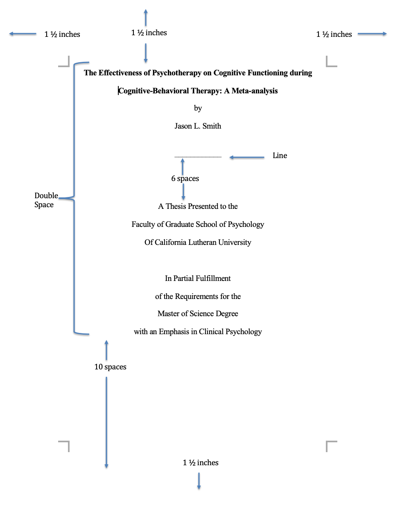

# Format of Paper - Overview {#format}

<!-- -->

___ 

 The thesis paper is completed in a manner consistent with the [Publication Manual of the APA (7th Edition)](https://www.amazon.com/s?k=apa+publication+manual+7th+edition&crid=7T10VJ2PYQZH&sprefix=apa+pu%2Caps%2C261&ref=nb_sb_ss_i_1_6).  Note that certain sections _do not_ follow APA instead and, instead, follow a style shown this manual.

|Order in Paper| Section | Style | 
|:---: | :--- | :--- |
|1| Title Page* | CLU Style |
|2|  Signature Page* | CLU Style |
|3| Dedication* | CLU Style |
|4| Acknowledgements* | CLU Style |
|5| Table of Contents* | CLU Style |
|6| Abstract | APA Style 7th Ed. |
|7| Introduction | APA Style 7th Ed. |
|8| Method | APA Style 7th Ed. |
|9| Results | APA Style 7th Ed. |
|10| Discussion | APA Style 7th Ed. |
|11| References | APA Style 7th Ed. |
|12| Tables | APA Style 7th Ed. |
|13| Figures | APA Style 7th Ed. |
|14| Appendices | APA Style 7th Ed. |

## Title Page

This page provides the name of the thesis project, names of the university and school or department, and date of completion. The title page should be prepared in accordance with the sample page found in this section. The date at the bottom of the page is the month and year the degree is awarded. The title page is unnumbered but is counted as page “i.”

<!-- -->

___

## Signature Page

This page provides the name of the author and blank lines for the signatures of the committee members, Program Director, and the Graduate Dean. The pages are signed when the committee members and Program Director determine that the thesis is complete. It should bear original signatures for all copies (typically three). The date at the bottom of the page is the date the degree is awarded; however, the page is not counted in the numbering system.

<!-- -->

___

## Dedication (optional)

This optional page contains a brief dedication to the individual(s) whom the author wishes to honor. If included, this page is numbered as page “ii” (lower case Roman numeral).

___

## Acknowledgements (optional)

This optional page lists persons and/ or institutions whom the author wishes to thank for their assistance in completing the thesis or project. Such assistance can be provision of personal, financial, or moral support, or access to data sets or subject populations. A brief statement as to the type of assistance provided may follow each person or institution named. If included, this page continues the lower case Roman numeral sequence begun above.

___

## Table of Contents

The table of contents page will be consistent with the below image.  Students can include additional sections as they see fit. 

<!-- -->

___

## Abstract (APA style)

The abstract follows APA style and is typically completed in the Spring Semester of the second year.  A draft of the abstract, without results and without concluding statements, might be drafted during *PSYC 565 Research Practicum* during the of the second year. 

___

## Introduction (APA style)

**Understanding the Problem**

The development of the literature review begins during the Fall Semester of the first year during PSYC 564 Advanced Research Methods.  The literature review will become the "introduction" section of the final thesis paper.  The literature review demonstrates the student's mastery of the literature surrounding the *problem* to be addressed by the thesis.  Initial drafts, such as that from PSYC 564, are 10-12 pages in length.  

The development of the literature review is, however, ongoing throughout the two-years of the program until the final draft is submitted on May 1st of the second year. The typical length of a *completed* introduction section is between **20-40 pages** long but there is no maximum length. 

In terms of content, students are encouraged to consider multiple perspectives in their work and also to integrate their thoughts related to culture and diversity regarding the topic area.  The idea here is that a good understanding of a problem area involves a thorough understanding of the context.  Context includes a consideration of the place, time, and people under study as well as the same characteristics of those who are doing the investigating.  

**Due**: 
  
  1. December 15th, first year (First Major Draft);
  2. May 15th, end of first year (Second Major Draft with Hypotheses); 
  3. May 1st, end of second year (Final Draft).
  
___

## Method (APA style)

**Solving the Problem**

The method sections defines the procedures of the thesis. The method section consists of the participant selection, selection of methods of measurements or materials, the procedure, and the data analytic method. The method section can be worked on in *PSYC 552 Psychometrics* and *PSYC 562 Statistics II: Regression* during the Spring Semester of the first year.  The method section is finalized during *PSYC 565 Research Practicum* in the Fall Semester of the second year when students prepare their submission to the [CLU IRB](https://www.callutheran.edu/research/irb/).

Students at CLU also pre-registered their hypotheses using [AS Predicted](https://aspredicted.org/).  A pre-registration is method of distinguishing between exploratory and confirmatory hypotheses.  The concept of pre-registration is discussed during _PSYC 521 Clinical and Research Ethics_ during the Summer Semester. 

Lastly, the method section should include a **power analysis.**  The primary purpose of the power analysis is to provide students with the best understanding of the size of the sample needed to successfully test their hypothesis(-es).   In other words, students should never have to say in their discussion "The study was limited due to a small sample size.  Future research should include a larger sample size."  When authors make this statement they are basically stating that they ran a pointless study.  If the study is _under-powered_ then the truth cannot be adequately discerned from the outset.  If the study finds significance, then it might be a false positive; if a study does not find significance then the authors say they likely would have if they had enough people.  In each of these instances there is no credible chance to fail and, meaningfully, advance science.

The power analysis should be calculated during the Summer Semester between year 1 and year 2 or during *PSYC 565 Research Practicum* in the Fall Semester of the second year.  A power analysis ***must be completed prior*** to IRB submission. 

**Video Resources:**

1. A conceptual overview of a power analysis can be found [here](https://www.youtube.com/watch?v=Lr-i4Ugoc5M).  If you like that professor, here is another video by him that I like on his personal [website](https://www.youtube.com/watch?v=XhfkodpyIsw)

2. An overview of power can also be found here through the Center for Open Science.
     
      [Part 1: What is Statisical Power](https://www.youtube.com/watch?v=-ZU7fbvSJ60)
      
      [Part 2: Consequences of low power](https://www.youtube.com/watch?v=7daQRvRO-NE) 
    
3. An article on the topic can found in [10 Resources](#resources).

**Due**: 

  1. May 1st, first year (First Draft);
  2. December 15th, second year (Second Draft including power analysis)

___

## Data Analytic Method (APA style)

The data analytic plan can be developed during _PSYC 562 Statistics II: Regression_ in the Spring Semester of the first year and finalized during _PSYC 565 Research Practicum_ in the Fall Semester of the second year.  

At CLU, we exclusively use the statistical program language called [R](https://www.r-project.org/). The data analytic section will also include a [power analysis](#method) as well a link to the study's [pre-registration](https://aspredicted.org/) of the data analysis as noted in the [method section of this manual](#method). 

___

## Results (APA style)

The results are typically drafted during the Spring Semester of the second year.  *PSYC 566 Thesis* is an independent study course.  There are no class meetings.  Instead, students meet with their thesis chair to review and write their analyses in the results section. 

The results section should be organized by study hypotheses.

___

## Discussion (APA style)

The discussion is a critical section of the research paper and is typically **10-pages** minimum.  In the discussion the student provide the following:

  * A summary of the proposed hypotheses and rationale.
  * A review of the results in narrative form without the presentation of any statistics.
  * A discussion of the implications of the results for each hypothesis. 
  * A discussion of future steps for each hypothesis.
  * A discussion of the limitations of the study in addressing each hypothesis.
  * Similar to the introduction, please consider culture and diversity in your discussion of the findings. 

The discussion section demonstrates the student's ability to place their study in the context of the larger literature and think more philosophically.  It is a space for creativity and ingenuity.  
  
___

## References (APA style)

References follow APA style.  Please make sure:

1. All citations _in text_ are in the _reference section_
2. All citations in the _reference section_ are cited _in text_.

___

## Tables, Figures, & Appendices (APA style)

Tables and Figures can be essential for helping a reader understand your data analysis and conclusions. Please follow APA formatting for all Tables and Figures.

If students choose to bind their thesis then they pay careful attention to formatting in order to maintain the margins of the paper (1.5" all around).  This can especially be a problem for Tables.

Appendices often include a student's curriculum vita, IRB approval form, and other materials.  

___

